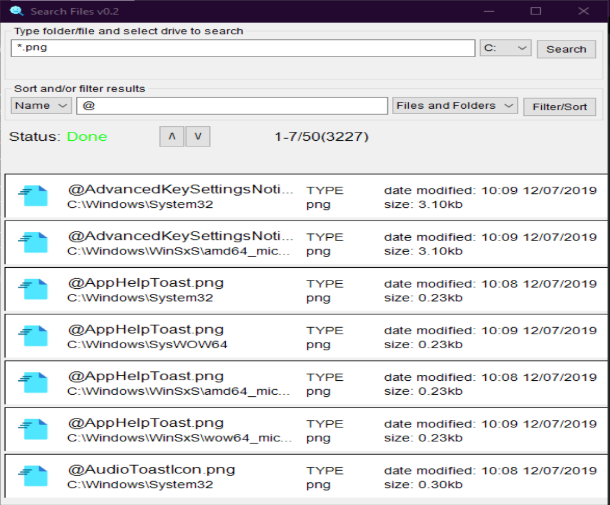
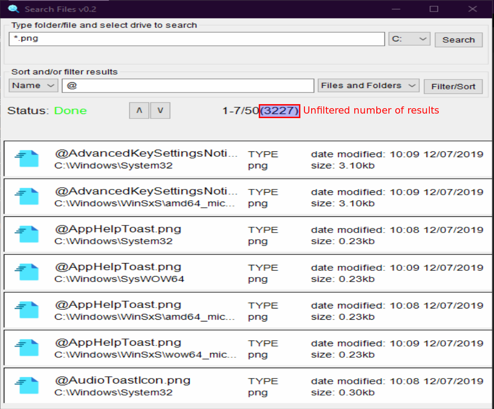

# SearchFiles

Simple file and folder search tool for Windows using:
- cmd to find results
- [Nigui](https://github.com/simonkrauter/NiGui) as GUI
- [Nim](https://github.com/nim-lang/Nim) language for bulding fast, lightweight app

## Instalation
App is only for Windows devices. 
- Dowload file .zip from release
- Unzip in location of your choice
- Run searchFiles.exe

## Bulding from source

If you do not want to run unknown .exe file in you computer, you can build binary yourself.

### Prerequisites:

- installed Nim
- installed NiGui
- installed MinGW

### Building:
Download files and run complie
```
git clone https://github.com/nobodybusiness/SearchFiles.git
cd SearchFiles
nim c -d:mingw -d:release --opt:speed --app:gui searchFiles.nim
```

## Performance - Comparision to Windows default search
In my not-scientific tests app finds results visibly faster then default Windows search engine. You can run simple search to compare speed:
- Run serachfiles.exe, type ```*.png``` select ```C:``` from drive list, do **not** click search button yet. 
- In Windows explorer go to C: drive and type in search bar ```*.png``` and immediately click serach button in app.
- Wait for results 

Complete indexing drives can change outcomes. You need to find for youself.

## How it works?
App runs ```cmd``` commands in the background to find results for specific drive.  
Used commands:  
>To find all devices
```
wmic logicaldisk get name
```
>To find files/folders by name
```
device: dir "\name*"/s 
```
>To open file/folder
```
start pathToFile\File.extension
```
## How to use ```*``` and ```.```
App is searching for all file/folders name like
```
yourSearch*
```
For example running ```test``` will find results such as
```
tests.txt
test.png
TeSt_xyz.md
TestFolder
```
You can add ```*``` char to find greater range of results.  
For example running ```*test``` will find same results that search above and additional results such as
```
MyTests.zip
MyTestFolder
```
You can add ```.``` char to find specific extension files
For example running ```test*.txt``` in first example would find only 
```
tests.txt
```
For multiple searches in same drive it can be faster to find **all** files in drive by running search for ```***``` and then filtering results. This was tested on **C** drive with ~200 000 found files/folders.  
It is equivalent of creating temporary index of all files/folders in selected drive and only then seraching results in that index.  
Filter options search in results for file/folder like
```
*yourSearch*
```
## Screenshots
### How it looks


## List ToDo - MoSCoW
### Must have
- [x] Correct opening folder/file on right/left click
- [x] Change generating buttons procces to draw only visible part of buttons and draw rest on scrolling
### Should have
- [x] Make sorting by type,date,name
- [x] Size not from mb, but from kb
- [ ] On return key search
- [x] Filter options for results
- [ ] Search all drives
- [ ] Search user selected path
### Could have
- [ ] Arrows key for scroll
- [ ] Getting icons on default opening program
## Free assets used in project
(<a target="_blank" href="https://icons8.com/icon/xTPIEYf4aSKO/easy-access">Easy Access</a> icon by <a target="_blank" href="https://icons8.com">Icons8</a>) used for files  
  
(<a target="_blank" href="https://icons8.com/icon/c2AXPLZ3iVEU/file-folder">File Folder</a> icon by <a target="_blank" href="https://icons8.com">Icons8</a>) used for folders  
  
(<a target="_blank" href="https://icons8.com/icon/myNNj6E9OAZ7/nothing-found">Nothing Found</a> icon by <a target="_blank" href="https://icons8.com">Icons8</a>) used for app  

## License
<sup>License MIT. Full license in file.  
THE SOFTWARE IS PROVIDED "AS IS", WITHOUT WARRANTY OF ANY KIND, EXPRESS OR IMPLIED, INCLUDING BUT NOT LIMITED TO THE WARRANTIES OF MERCHANTABILITY, FITNESS FOR A PARTICULAR PURPOSE AND NONINFRINGEMENT. IN NO EVENT SHALL THE AUTHORS OR COPYRIGHT HOLDERS BE LIABLE FOR ANY CLAIM, DAMAGES OR OTHER LIABILITY, WHETHER IN AN ACTION OF CONTRACT, TORT OR OTHERWISE, ARISING FROM, OUT OF OR IN CONNECTION WITH THE SOFTWARE OR THE USE OR OTHER DEALINGS IN THE SOFTWARE.</sup>