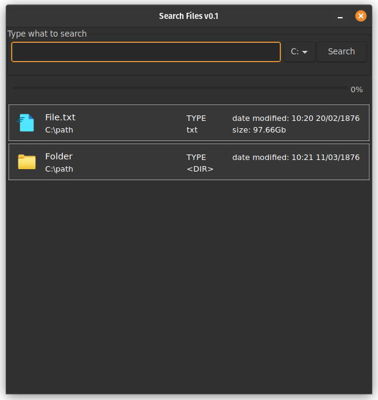

# SearchFiles

Simple file and folder search tool for Windows using:
- cmd to find results
- Nigui as GUI
- Nim language for bulding fast, lightweight app

## Instalation
App is only for Windows devices. 
- Dowload file .zip from realse
- Unzip in location of your choice
- Run searchFiles.exe

## Bulding from source

If you do not want to run unknown .exe file in you computer, you can build binary yourself.

### Prerequisites:

- installed Nim
- installed NiGui
- installed MinGW

### Building:
Download files and run complie
```
git clone https://github.com/nobodybusiness/SearchFiles.git
cd SearchFiles
nim c -d:mingw -d:release --opt:speed -d:nimNoLentIterators --app:gui searchFiles.nim
```
## Performance

### Problems
Now app try to draw all found result at once. If search is not specific enough, result will be not complete. It is intentional to avoid 'App stop responding' problem.  
In the future app should draw only part of result, and only after scroll to end of current showing results, load next part.

## Comparision to Windows default search
For specific enough file/folder search app (in my not-scientific tests) finds results visibly faster then default Windows search engine.  
Complete indexing drives can change outcomes. You need to find for youself.

## How it works?
App runs ```cmd``` commands in the background to find results for specific drive.  
Used commands:  
>To find all devices
```
wmic logicaldisk get name
```
>To find files/folders by name
```
device: dir "\name*"/s
```
>To open file/folder
```
start pathToFile\File.extension
```
## Screenshots
### How it looks


### How it could look
This is **NOT** how app looks, app just a comparison how much better (in my opinion) NiGui apps look on Linux

## List ToDo - MoSCoW
### Must have
- [ ] Correct opening folder/file on right/left click
- [ ] Change generating buttons procces to draw only visible part of buttons and draw rest on scrolling
### Should have
- [ ] Make sorting by type,date,name
- [ ] Size not from mb, but from kb
- [ ] On return key search
### Could have
- [ ] Arrows key for scroll
- [ ] Getting icons on default opening program
## Free assets used in project
(<a target="_blank" href="https://icons8.com/icon/xTPIEYf4aSKO/easy-access">Easy Access</a> icon by <a target="_blank" href="https://icons8.com">Icons8</a>) used for files  
  
(<a target="_blank" href="https://icons8.com/icon/c2AXPLZ3iVEU/file-folder">File Folder</a> icon by <a target="_blank" href="https://icons8.com">Icons8</a>) used for folders  
  
(<a target="_blank" href="https://icons8.com/icon/myNNj6E9OAZ7/nothing-found">Nothing Found</a> icon by <a target="_blank" href="https://icons8.com">Icons8</a>) used for app  

## License
<sup>License MIT. Full license in file.  
THE SOFTWARE IS PROVIDED "AS IS", WITHOUT WARRANTY OF ANY KIND, EXPRESS OR IMPLIED, INCLUDING BUT NOT LIMITED TO THE WARRANTIES OF MERCHANTABILITY, FITNESS FOR A PARTICULAR PURPOSE AND NONINFRINGEMENT. IN NO EVENT SHALL THE AUTHORS OR COPYRIGHT HOLDERS BE LIABLE FOR ANY CLAIM, DAMAGES OR OTHER LIABILITY, WHETHER IN AN ACTION OF CONTRACT, TORT OR OTHERWISE, ARISING FROM, OUT OF OR IN CONNECTION WITH THE SOFTWARE OR THE USE OR OTHER DEALINGS IN THE SOFTWARE.</sup>